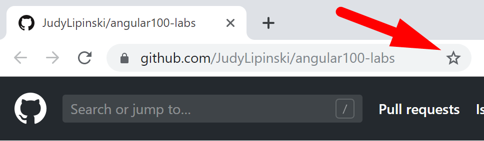
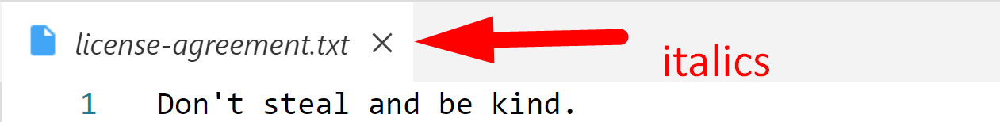
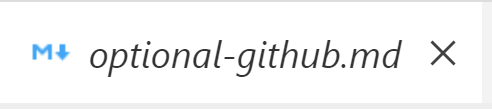
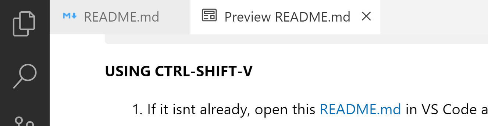
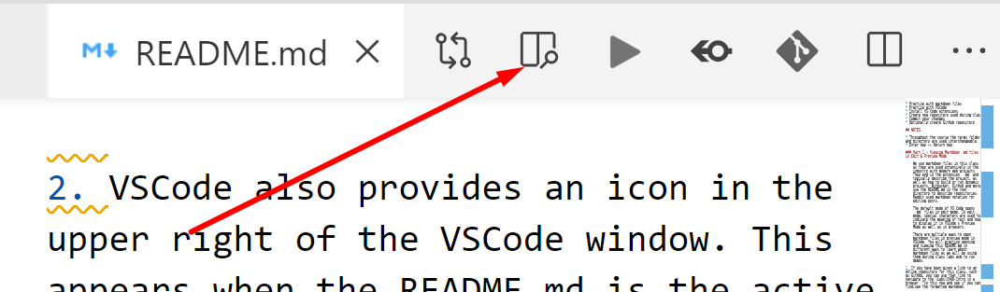
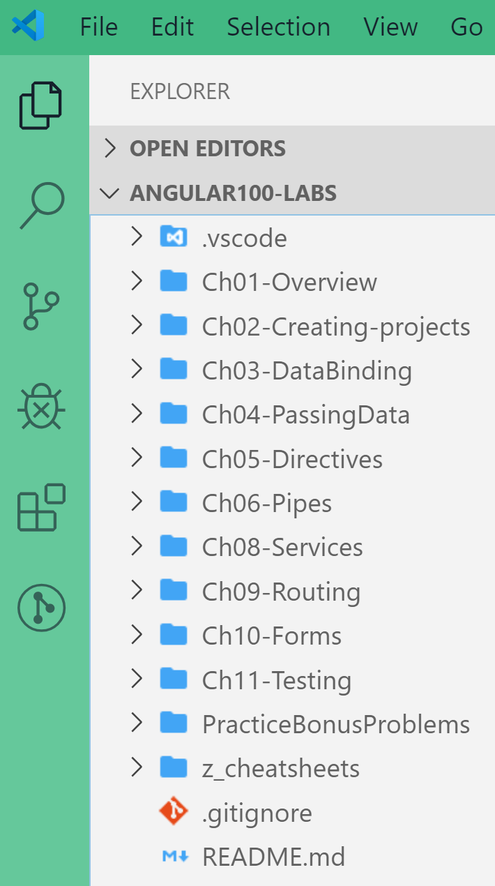
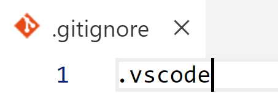
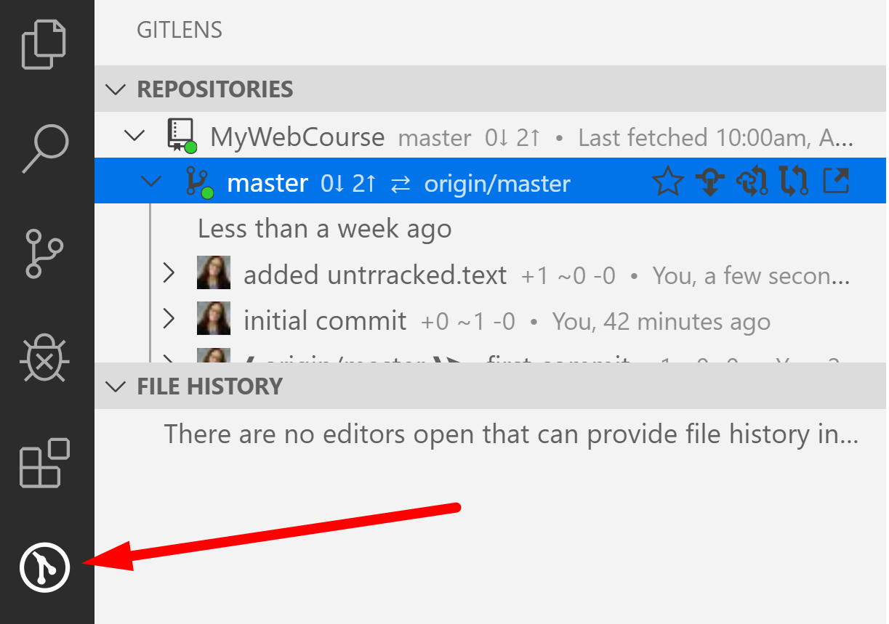
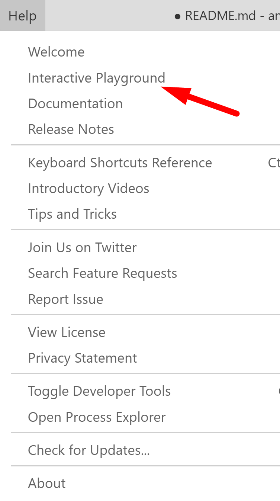

# Chapter 1: Using VS Code and creating a repository for your course work

## Objectives

* Practice with VS Code
* Practice with markdown files
* Install VS Code extensions
* Create new local repository used during class
* Commit changes
* Optionally create GitHub repository

## NOTES

* Please pay attention to detail. Follow each step carefully.
* Throughout the course the terms folder and directory are used interchangeable.
* You may see references to Enter key and Return key. These are the same intention, Enter is usually found on Windows and Return on Macs.
* You must save changes to your files to see the effects take place. Control+S is the FASTEST. You can also use File | Save but this wastes seconds - adding up to minutes, etc...

## Links to content below

[Part 1 - Navigating the course on Github](#part-1---navigating-the-course-on-github)

[Part 2 - Opening files in VS Code and changing default settings](#part-2---opening-files-in-vs-code-and-changing-default-settings)

[Part 3 - Markdown .md files in Edit & Preview Mode](#part-3---opening-markdown-md-files-in-edit--preview-mode)

[Part 4 - The Angular100-Labs project](#part-4---the-angular100-labs-project)

[Part 5 - Create Your Own Local Git Repo](#part-5-create-your-own-repository-for-your-coursework)

[Part 6 - Opening Multiple Instances of VS Code](#part-6---opening-multiple-instances-of-vs-code)

[Part 7 - Using VS Code to commit changes](#part-7---using-vs-code-to-commit-changes)

[Part 8 - Use .gitignore to not track changes](#part-8---using-gitignore-to-ignore-changes)

[Part 9 - View GitLens extension](#part-9---view-gitlens)

[Part 10 - Optionally create GitHub remote repo](#part-10-optional--setup-github-remote-repository)

[Bonus - Explore VS Code](#bonus)

   
### **Part 1 - Navigating the course on Github**

1. Throughout the course you can use the browser to navigate to the course Git repository Angular100-Labs (specific for your class). https://github.com/JudyLipinski/angular100-labs

    

    This is a good option if you are using a virtual machine for class and have more than one monitor. If this your situation, you may want to open this now on your other monitor as you move forward in the directions.

2. Bookmark this page for easier access later.  In Chrome can hit the star in the upper right hand side and choose Bookmarks bar. 
   
   
3. If you do not see the bookmarks bar, hit control+shift+B to make it appear.
   

### **Part 2 - Opening files in VS Code and changing default settings**  
[back to top](#links-to-content-below)

**Install and use VS Code Peacock extension**
[back to top](#links-to-content-below)

    The extensions pane allows you to search for, install, disable and remove extensions easily.

1. Look on the left side bar menu of VS Code and click on the `Extensions` icon or use the shortcut (Ctrl + Shift + X). 

    

2. Type into the Extensions Marketplace search field to find `Peacock` by John Papa. If you do not have it already installed click the install button.
   
   

    This extension lets us provide a color to the top and left sidebars of each instance of VS Code we open. 
    
    In the real world this is helpful as you may have reference implementation projects open as well as your own work.

    In this course it will be helpful as we will have different VS Code instances for 
    
    * Angular100-labs 
    * Angular100-solutions
    * Angular100-demos
    * MyAngularCourse (you will create in next Part) 
    
1. To use the extension, hit control+shift+p to bring up the command pallette and start typing Peacock.
   
   
   
2. You should see a list of options, choose Vue green to identify the VS Code instance for your labs.

   

**OPENING FILES IN VS CODE**

1. If you are viewing these instructions on Github now, make sure you also have VS Code open to the ANGULAR100-LABS project. One way of opening this is to navigate in 

   
2. By default, in VS Code when you single click files in the Explorer pane they open in a preview mode. This is indicated by italics in the tab. If you open another file it replaces the previous file. Try single clicking the file **license-agreement.txt**.

    

3.   Now single click the file **optional-github.md** and it will replace the **license-agreement.txt** file. 
    
        
       
4.   If you double click on the tab it will become solid and opening another file will not replace its contents.

        

5. To make single clicking not open in preview mode, you can change VS Code settings. First click the gear icon to open the settings menu.

    

6. Then in the search field start typing open. Click the editor manager under Workbench, and deselect the checkbox for Enable Preview.

    

7. Now single click the file **really-long-file.txt** and it should open in its own tab and not be in italics.
   
   
   
   **Toggle text wrapping**
8. If VSCode is not wrapping, you will just see one line of text and need to scroll to the right to see the contents. Use the View menu or shortcut of Alt-Z to toggle the word wrap.

    

9.  Notice the line number isn't incrementing it is still just one line - but easier to read.
   
   

### **Part 3 - Opening Markdown .md files in Edit & Preview Mode**
[back to top](#links-to-content-below)

    We use markdown files in this class for lab directions as they are used extensively in the industry with modern web projects.  
    
    These plain text files end in the extension .md and are used to describe Angular projects.
    
    Special characters are used to indicate the meaning of text and how to display it when used on websites.
    
    On repository sites such as GitHub and Bitbucket a README.md in the root directory describes repositories and how to build and run dynamic projects. If you like to use Reddit you can use markdown to style your posts.
    
    The default mode of VS Code opens .md files in EDIT MODE where you see the special characters for formatting. VS Code also offers a PREVIEW MODE so you can more easily read the styled text.

    We will look at multiple ways to open markdown files in PREVIEW MODE in VS Code. You will use these methods for lab exercises and some demos. 

**OPENING PREVIEW USING CTRL-SHIFT-V**

1. If it isnt already, open this README.md in VS Code and make sure that it has focus. (click this text in the VS Code editor if the document has lost focus).
   
2.  You can open a new tab in PREVIEW MODE by hitting control-shift-V. This will open the preview in a new tab. You can then switch back and forth using the tabs. 
   
   
   

   **OPENING A SPLIT SCREEN**

3. Open a Split screen in order to view both at the same time by clicking on this icon 
    

4. Drag the tab to the other window.
    

    You should now see the two files at the same time. With both Edit mode and Preview mode open in split panes, notice that if you scroll in one, the other scrolls as well.

    Remember this process to split the panes, it will be helpful when you want to see two files at the same time - such as lab instructions and the file you are editing.

    **VERTICAL MENU BUTTONS TOGGLE**

5. Give yourself more room to view code by hiding the leftmost pane. It should currently be the Explorer pane. Clicking the Explorer pane icon - pictured here with a blue circle and 1 will toggle this view. All of the icons in this vertical menu can be toggled to give you more room to work. Practice clicking to show and hide the menus.

    

    **MARKDOWN FORMATTING**

7. Make sure you can see both the Edit Mode in VS Code and the Preview Mode in VS Code or GitHub while you review the following:

    * Hash marks (#), are used for formatting headings.
        * A single # is heading "level 1" which is biggest, ## is "level 2", slightly smaller, and so on.
    * The asterisk is used to make a bullet.
        * Tabs are used for indentation of bullets.
    * Text can be highlighted using `backticks` around key words.
    * Code can be made **bold** using double asterisks.
    * Every item can be numbered as 1 in Edit Mode. When the markdown file is rendered: in preview mode or in browsers - the numbers will increment correctly.
        * This makes it easy to insert new items or re-order items, without needing to take the time to renumber.

    **OPEN PREVIEW TO SIDE**

8. Close all tabs in VS Code so that only the README.md is open in Edit Mode.
   
9.  When a markdown file is the active file, there is a button that automatically opens Preview in the split pane.

        Most everything in VS Code has a hover effect. If you forget what anything does, just hover over it.

    **OPENING FROM EXPLORER**
1. In VS Code, from the Explorer Pane, you can find the markdown file of interest, right click and choose **Open Preview**. Try this now with this README.md as shown.

1. In VS Code, while viewing in Preview mode, if you double-click an area of the file, you will be taken back to the EDIT VIEW or "source" markdown file for editing.

    Notice that if you double click the  image shown above - it takes you to the edit mode version where the image is linked.

2.  For the rest of this lab exercise, view this file in Preview mode or on GitHub. 

### **Part 4 - The Angular100-Labs project**
[back to top](#links-to-content-below)

1. Make sure you have VS Code open and can see the Angular100-Labs repository. Ensure the Explorer pane is visible, listing the files/directories. Recall to click the icon if the view is hidden. 

2. Understanding the Angular100-Labs repository
    * This repository contains the markdown files which are the instructions for the labs in this course. It is organized by chapter.  
    * There is a z-cheatsheets folder which contains help for VS Code, HTML, CSS       
    * Practice Bonus problems are available if you complete the regular exercises before others

1. There is no reason to make changes to these files. If you do make and save changes to any of these files, the VS Code source control icon (The Y looking icon in the vertical menu strip) will display a number for each file changed. 
   
    This prevents you from pulling additional bonus materials that may be added during the course.

    You can revert back to the original files by clicking this source control icon, hovering over the CHANGES menu and discarding all of the changes.

    

### **Part 5: Create your own repository for your coursework**
[back to top](#links-to-content-below)

You will create a repository called my-angular-albums. It will be tracked by Git so that if you accidentally delete or change files you can recover them easily. 

Additionally, and optionally, you will be able to connect your local repository to a remote GitHub repository. 

Git is an especially helpful tool while working with Angular. One reason for this is we will be using the Angular CLI tool to create and modify many files at once. 
    
Sometimes, you may accidentally run a command and modify a lot of files you did not mean to. It can be time consuming to clean this up! To make the process easier, and be able to UNDO - we will use a local Git repo to track our files.
   
1. Depending on your lab setup, the global config for git may or may have not been setup. You can verify this by typing these commands into a command prompt.  These are global settings so you can be in any directory.

    

2. If there are values present, that is all you need for a local Git repo to be able to commit (and more easily discard) your changes.  
    
    It is a good practice to match to the info you would use on a remote repository, such as  GitHub, but it is not required.

3. To set up your personal git username and email idenitifers, use these commands - replacing **John Doe** inside the quotes with your name and **johndoe@example.com** with your email. Again, these are global settings so you can be in any directory.

    

4. Execute the following commands to create a new folder for your work and to initialize a local Git repo. You may or may not see the warnings. Wherever you start using cd \ takes you to c:\
   
    

1. Test that you can add to your local repo and commit by executing the following commands. If you cannot commit, check that you set your global setting for user.name and user.email.

    

### **Part 6 - Opening Multiple Instances of VS Code**
[back to top](#links-to-content-below)

Quite often you will need to have multiple instances of VS Code open.
    
For example, you may be referring to a sample project and comparing to your own project. 

VS Code allows use of control+c and control+v to copy and paste files and directories between projects.  

1. From the Command Prompt within your **my-angular-course** directory execute the command **code .** to open the project in VS Code. 

    

2. You should now have two instances of VS Code running. In your my-angular-course use Peacock to change the color to C# purple. 

   1. Control+shift+p for command palette
   2. start typing peacock 
   3. choose C# purple
   
   

#### Switch between instances using Windows Task Bar

1. Move your cursor to the VS Code icon in  the windows status bar.
   
2. You should see your two VS Code instances with their colors. Peacock makes switching easier.

 

3. Click the **Angular100-Labs** project (green). If you are not using a virtual machine you can use Alt+tab to switch.

4. In **Angular100-Labs** find the file license-agreement.txt from the same  directory as this README.md. Click to highlight the license-agreement.txt file and hit Control-C or right-click to choose copy.
   
5. Switch back to your **my-angular-course** project and paste the file by right-clicking below your files and choosing paste.

 

  
### **Part 7 - Using VS Code to Commit Changes**
[back to top](#links-to-content-below)

By adjusting the color and copying a file into your project, you might have noticed the source control icon now has a number on it. Here we will practice with change tracking in projects.

1.  In your README.md file add your name.

    

2.  Click on the Source Control button to open the panel `Source Control`. In this panel, mouse over the README.md file; press the `+` button that appeared to stage the change. You can also stage the change by right clicking on the README.md and clicking `Stage Changes`. You should now see that `README.md` was added to `Staged Changes`

    

3.  Above `Staged Changes` you should see a text input field with the text **Message (press Ctrl+Enter to commit)**. Within this field enter a good commit message which describes the changes we staged in the previous step.

    

4.  Click the check mark above the text message field to commit the changes made to README.md
   
### **Part 8 - Using .gitignore to ignore Changes**
[back to top](#links-to-content-below)

Sometimes, you do not want Git to track certain files or directories. Git looks for a settings file called `.gitignore`. Any files or directories included in this file will not be tracked.

1. Create a file called `.gitignore` by viewing the explorer pane and hovering over the name of the project to reveal a menu. Choose the icon to create a new file and name it .gitignore.
   
   Notice there is an intentional period (.) proceeding the name of the file.

    

2. Open the .gitignore file and add this on the first line: .vscode
   
  
1. Now create a new file called `untracked.text` and inside add the text "This is a local file."
    * Save the file - and you should not see it being tracked by Git.

1.  Please mark your work as complete. With your name tent card if in a classroom or by using method for online training. (spreadsheet, status symbol, etc.) Then you can move on to the OPTIONAL part or Bonus below.

### **Part 9 - View GitLens** 
[back to top](#links-to-content-below)

1.  On VS Code's left hand toolbar, click on the `GitLens` extension you installed earlier. This extension contains additional features.

    

1.  Familiarize yourself with `GitLens'` panel. Notice how you can use it to access different repositories and their branches, remote, your stashes, etc. Also notice how you can navigate through it to see history of a file, a line, or compare files between different branches or between local and remote.

### **Part 10 OPTIONAL- Setup GitHub remote repository**
[back to top](#links-to-content-below)

1. If you have access to GitHub you can follow the directions in this folder's file [optional-github.md](./optional-github.md)  file. If others are done with this exercise already you can return to do this on a break or at a later time. It can be completed at any time before the end of class. 

## Bonus
[back to top](#links-to-content-below)

1. If done before others, explore the VS Code Interactive Playground
   

