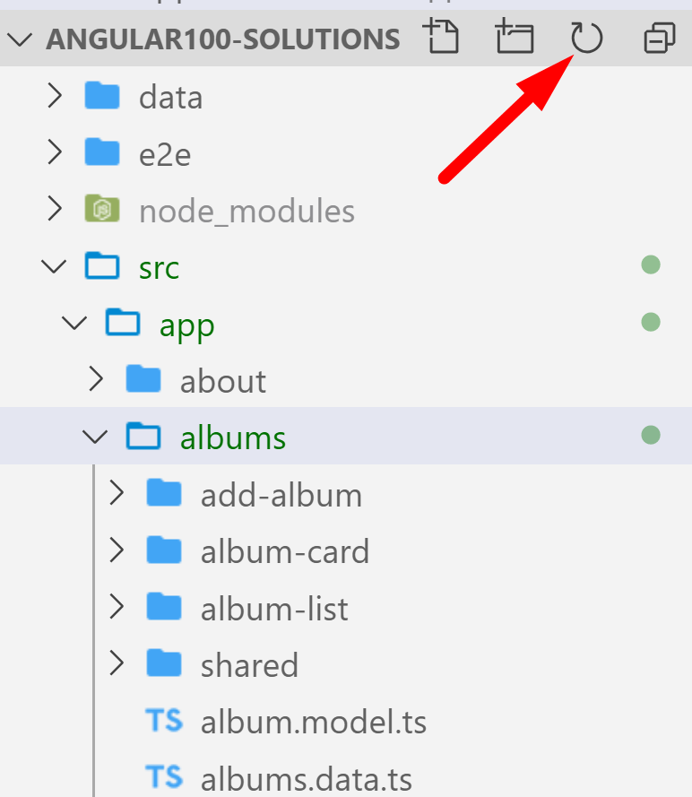
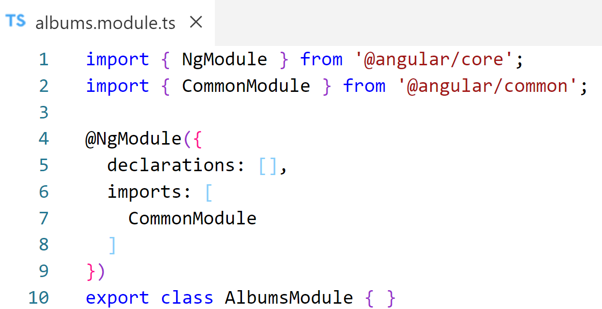
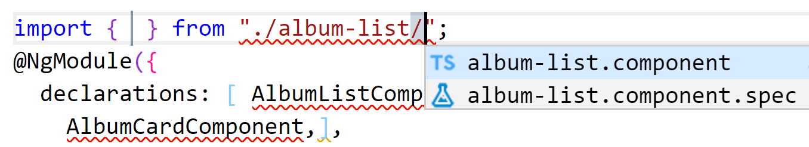
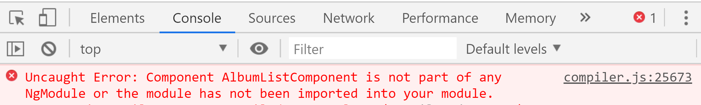
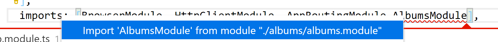

# Chapter 9 Routing: Feature Modules

## Objectives

- Organize your project by creating feature modules
- Import feature Modules into your AppModule
- Practice using dev tools to look at network traffic

## Steps

1. Continue working in your **my-angular-albums** project. If you haven't completed previous exercises, you can copy the last solution's src directory over your src directory.

1. Examine your current AppModule file. How many components are in the declarations?

1. Create a feature module for albums. If you already have the folder, it creates the module inside a folder of the same name.
   ```console
   ng g m albums
   ```

    You may need to ht the VSCode refresh button to see changes.

    

2. Note the structure created for the new module. Similar to our original AppModule, it has the @NgModule Decorator where we can add components. NOTICE how CommonModule is included. this makes ngFor type directives available to components in this module.  Think about where you can add the components related to this module.   
  
    

   
3. Update **albums.module.ts** and add the components to the declarations property. You can cut the album related entries (AlbumCard, AlbumList) from AppModule and paste them into this new AlbumsModule file. Make sure you include the import statements at the top. VSCode can help with some auto-completion when you start typing, as shown here.

    

1. Try to view the app in the browser. The App should load with a blank screen. Open the console to see the error message. Why do you think this is happening? What clue does the error message give you?
    


1. All components must be in ONE module. A component cannot be included in more than one module. We added the components to the new module, but did not add it to the Root Module. Now add the new AlbumsModule to the AppModule imports section. VSCode offers an import completion under Quick Fix.
  
    

1. Now reload your application. It should work.

1.  Mark your work as complete. 