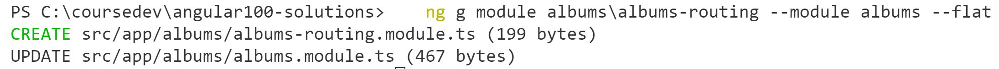

# Chapter 9 Routing: Lab 3 Lazy Loading Modules

## Objectives

- Use Lazy Loading with Routing in your application

## Steps

1. Continue working in your **my-angular-albums** project. If you haven't completed previous exercises, you can copy the last solution's src directory over your src directory.

2. Create an app routing module to be referenced within the albums module.

    ```console
    ng g module albums/albums-routing --module albums --flat
    ```

    You should see two changes.
     


3. In the AppRoutingModule file, modify the path for /albums to point to the feature module, rather than a component. 

    ```javascript
    {
        path: "albums", //Angular 8 Notation with Promise
        loadChildren: () => import('./albums/albums.module')
                            .then(mod => {
                            console.log('in promise loadChildren');
                            return mod.AlbumsModule;
                            }),
    },
    ```


4. Add a route in the newly created albums-routing.module.ts that points to the AlbumsListComponent - make sure the AlbumListComponent file is imported.

    ```javascript
    const routes: Routes = [
    { path: "", pathMatch: "full", component: AlbumListComponent }
    ];
    ```

5. In this same file, now register the routes in the @NgModule decorator in the imports property using forChild() - and indicate to export the RouterModule. Make sure the necessary classes are imported.  

    ```javascript
    @NgModule({
        imports: [RouterModule.forChild(routes)],
        exports: [RouterModule]
    })
    ```

6. Now test that your app works by loading it in the browser. Open the dev tools network traffic tab. 

1. Click on the albums button or link and you should see the module being lazily loaded. 

2.  Mark your work as complete. 