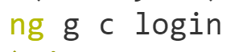
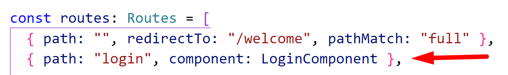
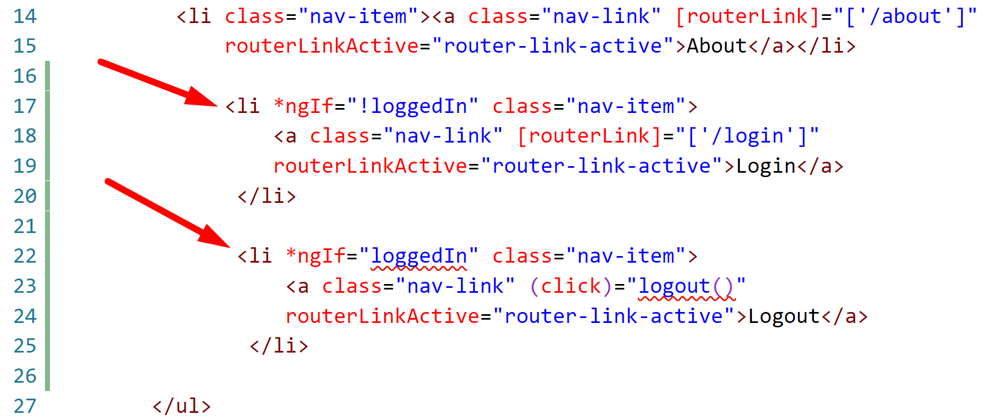
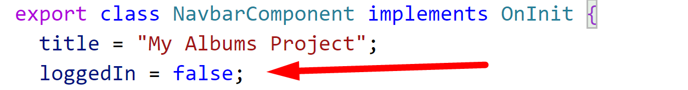
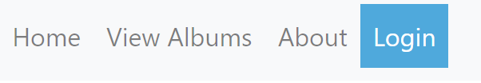
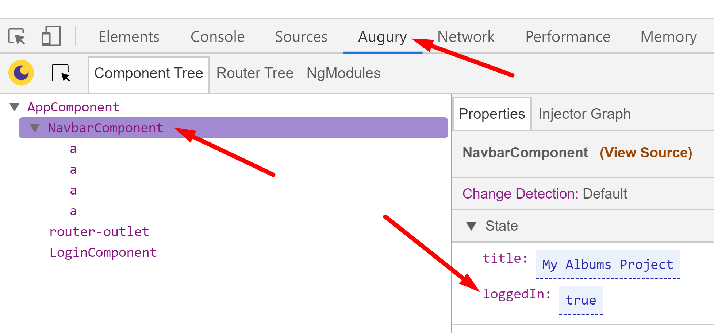
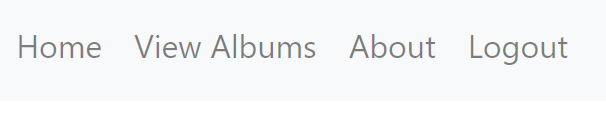
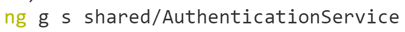

# Chapter 9 Routing: Route Guards

## Objectives

- Add a Route Guard to stop navigation to a page if not logged in

### **Part 1: Add Login/Logout to Navbar**

1. Continue working in your **my-angular-albums** project. If you haven't completed previous exercises, you can copy the last solution's src directory over your src directory.

1. First let's generate a new page for Login.
   
    
   
1. Add a route for the login to the AppRoutingModule.

    

1. Test that if you manually enter the URL with /login that you reach the login page.

1. In the navbar template file, add two entries after the About list item, before the closing **ul**

    

1. In the navbar component class - add the property loggedIn and set it to false.

    
   
2. Test your app, the navbar should display Login.

    

3. Use Augury to change the value of loggedIn to true. 

    

1. Your app should now display Logout.

    

 
### **Part 2: Create fake login process**

1. First let's create a very simplified AuthenticationService. 
    
   
  
2. In the same folder as this README is an It allows components to see the logged in status and be notified when it changes.
   
3. This is not a complete 

4.  Mark your work as complete.
