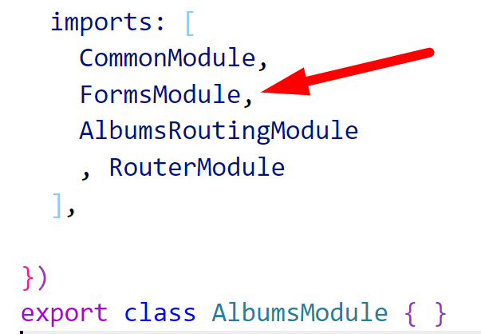
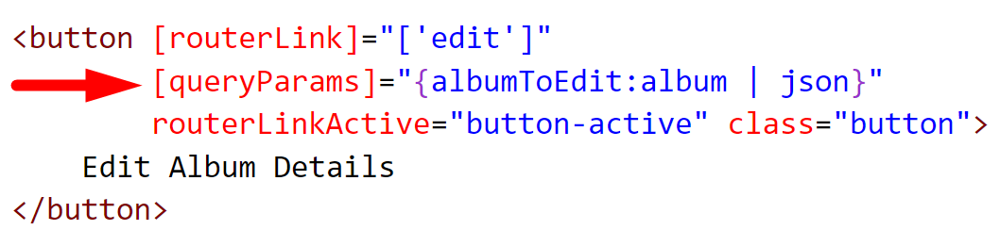
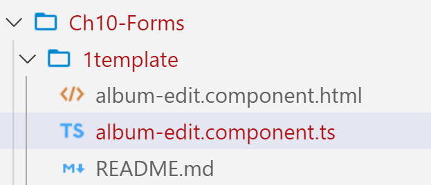
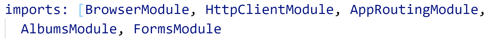

# Chapter 10 Forms: Template Driven - Edit Album

## Objectives

- Use template form to edit an album

## Steps

1. Continue working in your **my-angular-albums** project. If you haven't completed previous exercises, you can copy the src directory from the solution files from the last exercise.

2. Follow the steps, noting that you can copy the content from included files in the lab. Either by navigating to this folder on GitHub and viewing files, or from a local angular100-labs folder.

    Online folder of files:
    https://github.com/JudyLipinski/angular100-labs/tree/master/Ch10-Forms/1template
   
3. Modify the AlbumService to include the use of HttpClient's put. We will use this to save the data changes. You can copy the content from **code-for-album-service.txt**

4. You need to import the **FormsModule** into your Albums feature module just as you did the CommonModule to make the directives for forms available.
   
   Note: Providers made available at root are available to features because of the way injectors work. Modules which give us access to directives such as FormsModule or CommonModule must be imported into the feature modules where you need them.

     

5. Make sure you also import the FormsModule so that your code compiles. When changing modules, it can be good to start and restart your server as modules may have already been loaded into memory.
   
6. Modify your **album-details.component.html** file so that you pass the album as query parameters. This is possible through this notation - passing an object with the property albumToEdit and the value is the object as a JSON string.

     


7. From the same directory as this README - copy the file content for album-edit component and html to replace yours.
   

8. In VS Code editor, view the contents of the **album-edit.component.ts** file - noting the following:
   *  What is dependency injected into the constructor, and why?
   *  note teh use of queryParamMap in ngOnInit() to get access to the query param that was sent
   *  we only are sending one so we get that string and parse it to get back to the object
   *  editAlbum will be called passing the album object that is modified in the form

9.  In VS Code editor, view the contents of the **album-edit.component.html** file - noting the following:
   * how is the template variable #form used to describe form state?
   * where is two way data binding being used?
   * what happens when the form is submitted? 
     * Trace this through into the album-edit.component.ts file

11. Note how the data can be receved form the query parameters.

# **try now to see the url in browser**
 


9.  In the same file's @NgModule decorator import **FormsModule** to be able to create a template driven form. 

    


10. In the same folder as this file, open the file **add-album.component.html** and copy its content over the content in your project's **add-album.component.html**. Do the same with **add-album.component.ts**

11. Notice how the use of [ngModel] sets up two way data binding

12. Update **album.service.ts** to include a method to add an album.

  ```typescript
    addAlbum(album: Album): Observable<Album> {
      return this.http.post<Album>(this.url, album);
    }
  ```

7. Try to reach the page to Add Album. You should see errors in the console. Can you figure out what these are referring to?

9.  
==========================================

1. Mke it so that when album is submitted taken back to list of albums.

10. Notice the button cannot be submitted until the form is valid.

11. Test your changes in the browser. Fill out the form and submit. You should see the data make its way into the json file that json-server is using.

## Bonus

1.  Add a remove button on the details page that when clicked calls a method you create which uses a service to delete the item.
