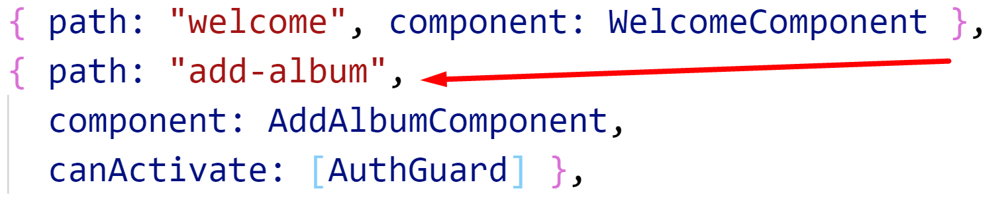

# Chapter 10 Forms: Template Driven - Add Album

## Objectives

- Use template form to add an album

## Steps

1. Continue working in your **my-angular-albums** project. If you haven't completed previous exercises, you can copy the solution files from the last exercise.

1. Create a component for adding albums.

   ```bat
      ng g component albums/add-album
   ```

1. Create a link in the nav bar template to add an album. Add this code before the li for the login/logout functionality:
    ```html 
      <li class="nav-item">
        <a class="nav-item nav-link" routerLink="/add-album" routerLinkActive="active">Add Album</a>
      </li>
    ```

1. Add a route to Routes in **app-routing.module.ts** ensuring import is added correctly. Place this near the top of your routes, before the ** wildcard. Use the AuthGuard created previously.

    
   Copy the following:
   ```typescript
     { path: "add-album", component: AddAlbumComponent,
     canActivate: [AuthGuard] }
   ```

1. Test that the page loads from the navbar with the default template that it works.

2.  In **app.module.ts** at the top of the file add the ES6 import:

    
  
3.  Below in the @NgModule decorator import **FormsModule** to be able to create a template driven form. 

    

1-appmodule-imports-formsmodule.png


5.  In the same folder as this file, open the file **add-album.component.html** and copy its content over the content in your project's **add-album.component.html**. Do the same with **add-album.component.ts**

6.  Notice how the use of [ngModel] sets up two way data binding

7.  Update **album.service.ts** to include a method to add an album.

  ```typescript
    addAlbum(album: Album): Observable<Album> {
      return this.http.post<Album>(this.url, album);
    }
  ```

10. Notice the button cannot be submitted until the form is valid.

11. Test your changes in the browser. Fill out the form and submit. You should see the data make its way into the json file that json-server is using.

## Bonus

1.  Add a remove button on the details page that when clicked calls a method you create which uses a service to delete the item.
